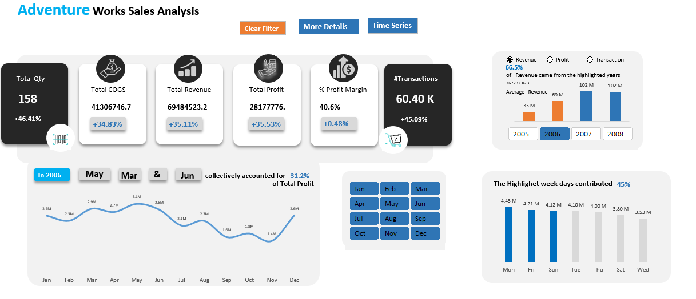

# Adventure_Sales_Dashboard

This analysis is performed on a public dataset that holds the transaction information of particular company

## About the Dataset
The dataset includes several sheets
- FactInternetSales
  - This sheet contains transactional information such as order date, Order Id,Sales Amount,Total Product Cost
- DimProd
  - This sheet contains information about the product such as ProductKey,ProductAlternateKey,ProductSubcategoryKey
- DimSalesTerritory
  - Includes the Geographical locations of the sales
- DimDate
  - Includes Data Information,Month,FiscalYear
- DimCustomer
  - Information about customer such as age,birthdate,gender, among others
- DimGeography
  GeographyKey, City, StateProvinceCode, StateProvinceName, CountryRegionCode, EnglishCountryRegionName

## Project Scope

This project is about carrying out an analysis on the the sales made by this company such as Total Transactions, Total Revenue, Total COGs,Timeseries
analysis among others 
The dashboards provide a detailed analysis of the above mentioned on specific period,year and date 

## Findings
- The company had a `**60.40 K**` transactions
- A total revenue of `**307.09 M**` across all the years
- Total cost of goods that summed up to `**180.80 M**`
- Order Quantity of Goods that summed up to `**631.92K**`
- Also received a profit of `**126.2 M**` across 4 years
- Amongst the `**606**` products the company managed to sell `158` products and unsold `448` products

## Profit Breakdown Analysis

#### Products
I carried out an analysis of the Top-5 five products.These included all the 5 categories of Road-150 Red led by Road-150 Red 48,
Road-150 Red 52, Road-150 Red 62, Road-150 Red 56, and Road-150 Red 44 as the Fifth.The Top-5 products contributed a profit percentage
`**24.8%**` compared to others that had `**75.2%**`

#### Customers
The company had a total number of  `**18,484**` customers with an average age of 46 years and slighlty equal profit by gender with a percentage of `**50.4%**` being male and `**49.6%**` females
Also notice that people above 50 years contributed a bigger percentage of profit of `**63.1%**` compared to those below 50
The top 5 customers had a `**0.3%**` profit contribution compared to others customers that contributed up to `**99.7%**` 
Below is a screenshot of the profit analysis breakdown

 
